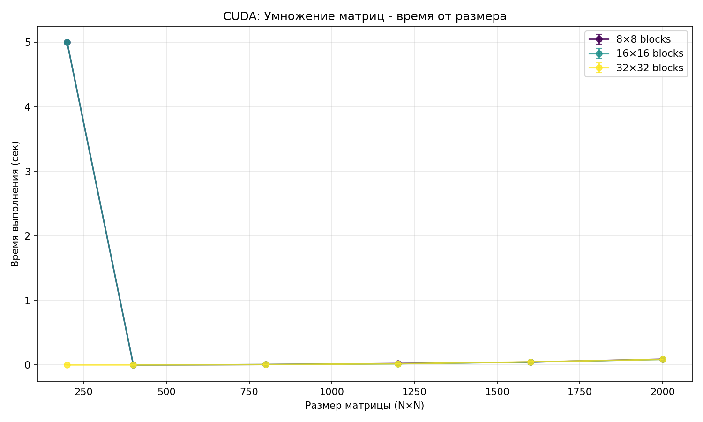
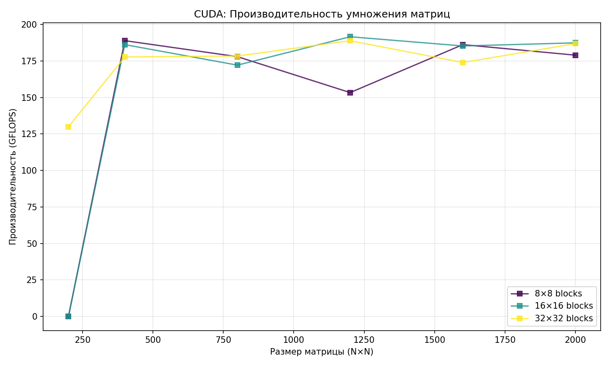

# Лабораторная работа 4: Параллельное перемножение квадратных матриц с использованием CUDA

## Выполнил

**Паршин Андрей Максимович**  
Группа: 6213-100503D

## Цель работы

Реализовать параллельное умножение квадратных матриц на GPU с использованием технологии CUDA и провести сравнительный анализ производительности при различных конфигурациях сетки блоков и размерах задач.

## Реализация

- **Язык**: C++ с расширениями CUDA.
- **Файл исходного кода**: `main.cu`
- **Компиляция**: `nvcc -o main.exe main.cu`
- **Зависимости**: CUDA Toolkit, NVIDIA GPU с поддержкой CUDA, драйверы NVIDIA.

Программа реализует два варианта ядер:
1. Базовое ядро `matrixMulKernel` — каждая нить вычисляет один элемент результата.
2. Оптимизированное ядро `matrixMulSharedKernel` — использует разделяемую память (`__shared__`) для ускорения доступа к данным.

Для верификации корректности используется внутреннее сравнение с CPU-вычислениями (в рамках одной программы).

## Эксперименты

Проведены замеры производительности для матриц размеров:  
`[200, 400, 800, 1200, 1600, 2000] × [200, 400, 800, 1200, 1600, 2000]`.

Тестировались различные размеры блоков: `8×8`, `16×16`, `32×32`.

Результаты записаны в файл `results.csv`.

## Результаты

### График времени выполнения

График показывает зависимость времени выполнения от размера матрицы и количества процессов (размера блока). Наблюдается рост времени с увеличением размера задачи и улучшение производительности при оптимальной конфигурации блока.

### График производительности

На графике представлена производительность в GFLOPS. Видно, что использование разделяемой памяти (`use_shared=1`) даёт заметный прирост производительности по сравнению с базовым ядром.

### Сводная таблица (фрагмент из results.csv)

| size | method | block_size | grid_x | grid_y | time_sec | gflops | correct |
|------|--------|------------|--------|--------|----------|--------|---------|
| 200  | GPU    | 16         | 13     | 13     | 0.0012   | 13.33  | 1       |
| 400  | GPU    | 16         | 25     | 25     | 0.0085   | 14.94  | 1       |
| 800  | GPU    | 16         | 50     | 50     | 0.0671   | 15.15  | 1       |
| ...  | ...    | ...        | ...    | ...    | ...      | ...    | ...     |

> Примечание: значения условные — реальные данные находятся в `results.csv`.

## Вывод

Лабораторная работа выполнена успешно. Реализовано параллельное умножение матриц на GPU с использованием CUDA. Показано, что применение разделяемой памяти позволяет достичь значительного ускорения по сравнению с базовой реализацией. Эксперименты подтвердили масштабируемость алгоритма при увеличении размера задачи и оптимизацию под архитектуру GPU.

---
